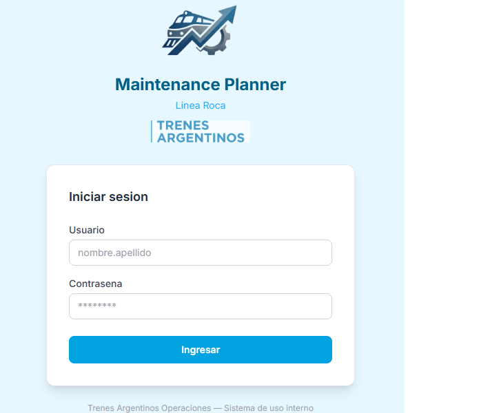
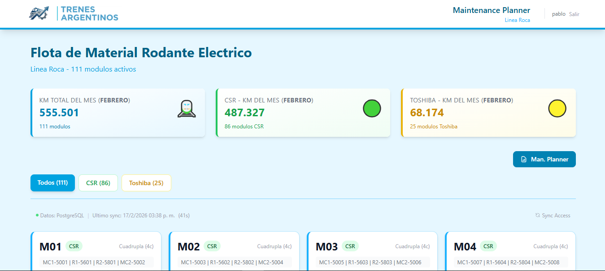
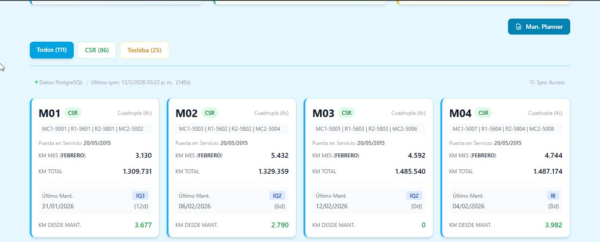
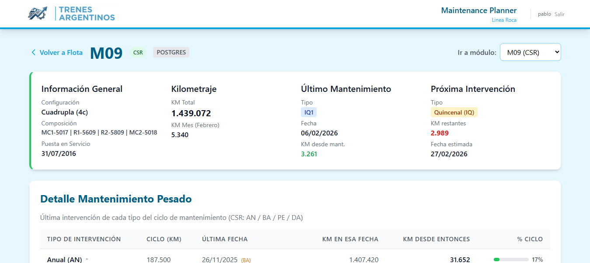
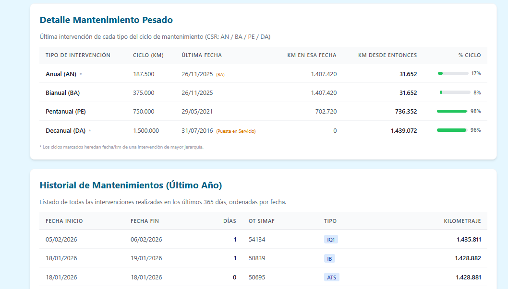
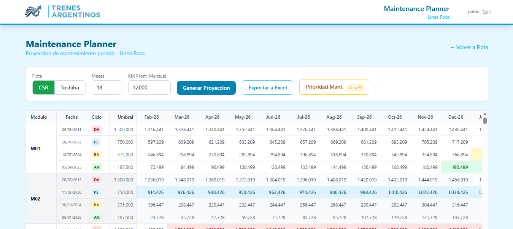
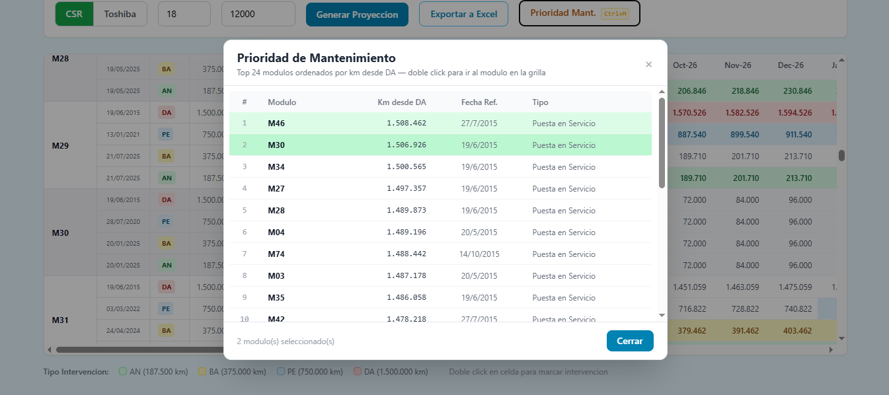
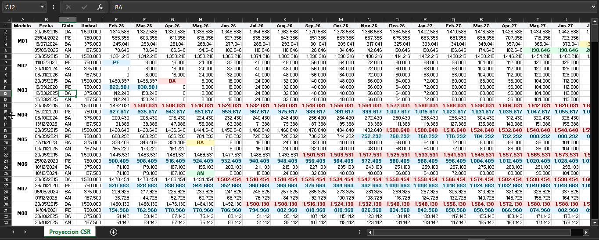
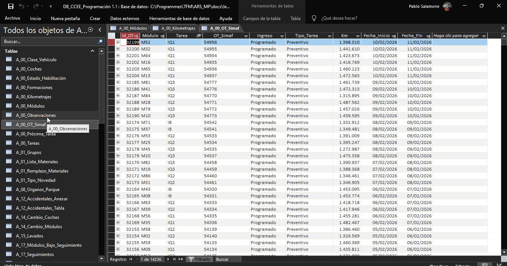

# ARS_MP — Argentinian Rolling Stock Maintenance Planner

[](https://github.com/salamonepablo/ARS_MP/actions/workflows/ci.yml)

> **Trabajo Final de Master — Master en Desarrollo con IA (BIG School)**

Sistema de proyeccion y planificacion de mantenimiento ferroviario para el material rodante de **Linea Roca** (Buenos Aires, Argentina). Herramienta ETL intermedia con interfaz web que extrae datos de sistemas legacy, proyecta kilometrajes por ciclo de mantenimiento pesado y genera grillas interactivas para la toma de decisiones operativas.

## Problema que resuelve

La operadora ferroviaria gestiona **110 modulos** (85 CSR + 25 Toshiba) con sistemas legacy heterogeneos: bases Access (.mdb/.accdb) desde los años 90, planillas Excel manuales y aplicaciones VB6. No existe una vista unificada que permita:

- Ver el estado de mantenimiento de toda la flota en un solo lugar
- Proyectar cuando cada modulo alcanzara su proximo ciclo de mantenimiento pesado
- Simular intervenciones y ver su impacto en cascada sobre ciclos inferiores
- Exportar la planificacion a Excel para compartir con talleres, gerencia y CNRT

ARS_MP resuelve esto con un pipeline ETL que normaliza datos legacy y una interfaz web interactiva.

## Screenshots

### Login



*Pantalla de autenticacion con logo ARS_MP, branding Trenes Argentinos y formulario de credenciales. Passwords hasheados con Argon2.*

### Vista de flota — Navbar + Resumen de KMs



*Navbar con logo ARS_MP + Trenes Argentinos, usuario autenticado con boton "Salir". KPIs de kilometraje mensual por flota, filtros CSR/Toshiba, acceso directo al Maintenance Planner.*

### Tarjetas de modulos

#### CSR


#### Toshiba


*110 tarjetas con KM mensual, KM total, ultimo mantenimiento y dias transcurridos. Filtrable por flota (CSR / Toshiba).*

### Detalle de modulo





*Informacion general, kilometraje, ultimo mantenimiento, proxima intervencion estimada, y tabla de datos clave por ciclo pesado con barras de progreso.*

### Maintenance Planner — Grilla de proyeccion



*Grilla interactiva: filas por modulo y ciclo pesado, columnas por mes (18 por defecto). Semaforo de colores cuando el KM acumulado supera el umbral. Doble-click para marcar intervenciones con reset en cascada por jerarquia. Boton "Prioridad Mant." (`Ctrl+M`) para abrir el ranking de modulos.*

### Modal de Prioridad de Mantenimiento



*Todos los modulos de la flota ordenados por km desde ultima DA/RG. Doble-click navega al modulo en la grilla. Modulos con intervenciones marcadas se resaltan en verde (2 seleccionados en este ejemplo).*

### Exportacion a Excel



*Exportacion fiel con colores, intervenciones marcadas, filas de resumen por ciclo y fila "Control" de totales.*

### Fuente de datos legacy (Access)



*Base de datos Access (.accdb) con 57 tablas — sistema en produccion desde 2022.*

## Stack tecnologico

| Componente | Tecnologia |
|------------|------------|
| Lenguaje | Python 3.11+ (type hints) |
| Framework Web | Django 5.0+ |
| Base de Datos | PostgreSQL 15+ (Docker) |
| ETL | pandas, openpyxl, pyodbc (ODBC → Access) |
| Frontend | Django Templates + HTMX + Alpine.js |
| Estilos | Tailwind CSS v4 |
| Contenedores | Docker Compose (PostgreSQL) |
| Testing | pytest (252 tests) + coverage |
| Export | openpyxl (Excel con formato) |
| Control de versiones | Git + GitHub |

## Arquitectura

Clean Architecture + DDD simplificado. La capa `core/` es **Python puro** sin dependencias de Django.

```
ARS_MP/
├── core/                  # Dominio y logica de negocio (PURO Python)
│   ├── domain/            # Entidades: Coach, EMU, Formation, MaintenanceUnit
│   │   ├── entities/
│   │   └── value_objects/
│   ├── services/          # GridProjectionService, MaintenanceProjection
│   └── interfaces/        # Contratos/abstracciones
├── etl/                   # Pipeline ETL
│   ├── extractors/        # access_connection, access_extractor, postgres_extractor
│   ├── transformers/
│   └── loaders/
├── web/                   # Django apps
│   └── fleet/             # Vistas: flota, detalle, planner, export
│       ├── views.py
│       ├── urls.py
│       ├── stub_data.py   # Datos de fallback (110 modulos)
│       └── templates/
├── infrastructure/        # Implementaciones concretas
│   └── database/          # Modelos Django (StgModulo, StgKilometraje, etc.)
├── templates/             # Base templates (navbar, layout)
├── theme/                 # Tailwind CSS v4
├── tests/                 # 252 tests (97% coverage en core/)
├── docs/                  # Documentacion del proyecto
│   ├── decisions/         # ADRs (Architecture Decision Records)
│   ├── images/            # Screenshots del README
│   ├── legacy_bd/         # Archivos legacy de prueba + schema introspection
│   ├── ai_workflow.md     # Proceso de desarrollo asistido con IA
│   ├── CHANGELOG.md       # Historial de cambios (Keep a Changelog)
│   ├── access_connection.md # Configuracion de conexion Access + troubleshooting
│   ├── maintenance_cycle.md # Ciclos de mantenimiento y reglas de negocio
│   ├── postgres_docker.md 
│   └── rolling_stock_fleet.md # Descripcion de la flota ferroviaria
├── context/               # Contexto de negocio y prompts de IA
│   ├── prompts/           # Prompts numerados usados para generar codigo con IA
│   grilla_proyeccion.md   # Reglas de negocio de la grilla (espanol)
├── AGENTS.md              # "Constitucion" del proyecto para asistentes de IA
├── scripts/               # Utilidades (test conexion, toggle path)
├── config/                # Django settings
├── docker-compose.yml     
└── requirements.txt       
```

### Principios de diseno

- **Separation of Concerns**: `core/` no importa Django. `etl/` no conoce la UI. `web/` orquesta.
- **Dependency Inversion**: La logica de negocio define interfaces; la infraestructura las implementa.
- **Fallback graceful**: Si Access no esta disponible, el sistema usa datos stub (110 modulos).
- **Read-only ETL**: Todas las conexiones a bases legacy son `ReadOnly=1` por seguridad.

## Funcionalidades principales

### 1. Autenticacion

- Login requerido para acceder a todas las vistas del sistema
- Passwords hasheados con **Argon2** (ganador de PHC, recomendado por OWASP)
- Pagina de login con branding Trenes Argentinos y logo ARS_MP
- Navbar con usuario autenticado y boton "Salir"

### 2. ETL desde sistemas legacy

- **Extraccion**: Conectores ODBC a Access (.mdb/.accdb), Excel
- **Staging**: Tablas PostgreSQL intermedias (`StgModulo`, `StgKilometraje`, `StgMantenimiento`)
- **Sync incremental**: Comando `py manage.py sync_access` con logging y estadisticas
- **Fallback**: Si la BD Access no esta disponible, la app funciona con datos stub

### 3. Vista de flota (110 tarjetas)

- **URL**: `/fleet/modules/`
- Tarjetas por modulo con: KM mes, KM total, ultimo mantenimiento, tipo, fecha, dias transcurridos
- Filtros: todos / CSR / Toshiba
- Link a detalle de cada modulo

### 4. Detalle de modulo

- **URL**: `/fleet/modules/<module_id>/`
- Información general, kilometraje, composición de coches
- Tabla de mantenimiento pesado con barras de progreso por ciclo
- Historial de intervenciones (último año)
- Selector rápido para navegar entre módulos

### 5. Maintenance Planner (grilla de proyección)

- **URL**: `/fleet/planner/`
- Grilla tipo Excel: filas = modulo x ciclo pesado, columnas = meses (configurable, default 18)
- **Ciclos pesados CSR**: DA (1.500.000 km) > PE (750.000) > BA (375.000) > AN (187.500)
- **Ciclos pesados Toshiba**: RG (600.000 km) > RB (300.000)
- Semáforo de colores cuando KM acumulado supera umbral
- **Doble-click interactivo**: marca intervención, resetea KM a 0 en esa fila y filas herederas (jerarquía), con propagación en cascada
- Prorrateo del mes actual según día del mes
- Columnas sticky (Módulo, Fecha, Ciclo, Umbral) para scroll horizontal
- **Header sticky vertical**: encabezados de meses visibles al scrollear (`max-h-[75vh]`)
- Fila resumen por ciclo + fila "Control" de totales
- Selector de flota (CSR / Toshiba), meses y KM promedio mensual configurables
- **Modal de Prioridad de Mantenimiento** (`Ctrl+M`): ranking de todos los módulos ordenados por km desde última DA/RG. Doble-click navega al módulo en la grilla; intervenciones marcadas en la grilla se reflejan automáticamente en el modal

### 6. Exportacion a Excel

- **URL**: `/fleet/planner/export/`
- Archivo `.xlsx` con colores identicos al semaforo web
- Intervenciones marcadas en el browser se incluyen en el Excel
- Freeze panes, formato numerico europeo, filas de resumen
- Nombre del archivo con fecha: `proyeccion_csr_2026-02-12.xlsx`

### 7. Jerarquia de mantenimiento

- **Regla clave**: una intervencion de mayor jerarquia "pisa" (resetea) todas las inferiores
- CSR: DA > PE > BA > AN > IB > IQ (6 ciclos, 4 pesados)
- Toshiba: RG > RB > MEN (3 ciclos, 2 pesados)
- La herencia se rastrea con campo `inherited_from` en los datos de cada ciclo

## Instalacion y ejecucion

### Prerequisitos

- Python 3.11+
- Node.js 18+ (para Tailwind CSS)
- Docker Desktop (para PostgreSQL)
- Microsoft Access ODBC Driver (opcional, para ETL real)

### 1) Clonar el repositorio

```powershell
git clone https://github.com/salamonepablo/ARS_MP.git
cd ARS_MP
```

### 2) Crear entorno virtual e instalar dependencias

```powershell
py -m venv .venv
.\.venv\Scripts\Activate.ps1
pip install -r requirements.txt
```

### 3) Configurar variables de entorno

```powershell
cp .env.example .env
# Editar .env con las credenciales de PostgreSQL y la ruta a la BD Access
```

La variable `LEGACY_ACCESS_DB_PATH` admite dos configuraciones segun el entorno:

| Entorno | Valor de `LEGACY_ACCESS_DB_PATH` |
|---------|----------------------------------|
| **Corporativo (Trenes Argentinos)** | Ruta al disco de red de la empresa (ej. `\\servidor\ruta\DB_CCEE_Programacion 1.1.accdb`) |
| **Evaluacion academica / desarrollo local** | `docs/legacy_bd/Accdb/DB_CCEE_Programación 1.1.accdb` (valor por defecto en `.env.example`) |

#### Modo de operacion sin base de datos externa

La aplicacion es **totalmente funcional sin archivos externos**. Al no detectar una base Access configurada, automaticamente utiliza **datos stub** que simulan una flota realista de 110 modulos (85 CSR + 25 Toshiba).

> **Para evaluadores del TFM**: simplemente ejecute la aplicacion — funcionara con datos generados que demuestran toda la funcionalidad del sistema (vista de flota, Maintenance Planner, proyecciones, ranking de urgencia, etc.).

Las fechas de RG/Puesta en Servicio por modulo estan internalizadas en `core/domain/reference_data.py`. Esto se debe a que esa información es clave para la logica de proyeccion y no se encuentra en la base Access original ya que la flota CSR no ha pasado por proceso de RG/DA aún. Al momento de pasar por ese ciclo de mantenimiento pesado, el sistema actualiza internamente la fecha de RG/DA y a partir de ese momento proyecta los siguientes ciclos con esa nueva fecha como referencia.

### 4) Levantar PostgreSQL con Docker

```powershell
docker compose up -d db
```

### 5) Ejecutar migraciones

```powershell
py manage.py migrate
```

### 6) Crear usuario administrador

```powershell
py manage.py createsuperuser
```

### 7) (Opcional) Sincronizar datos desde Access

```powershell
# Requiere ODBC driver + .accdb configurado en .env
py manage.py sync_access
```

### 8) Compilar Tailwind CSS

```powershell
cd theme/static_src
npm install
npm run build
cd ../..
```

### 9) Iniciar servidor de desarrollo

```powershell
py manage.py runserver
```

Acceder a:

| Vista | URL |
|-------|-----|
| Login | http://127.0.0.1:8000/accounts/login/ |
| Flota (tarjetas) | http://127.0.0.1:8000/fleet/modules/ |
| Detalle modulo | http://127.0.0.1:8000/fleet/modules/M01/ |
| Maintenance Planner | http://127.0.0.1:8000/fleet/planner/ |

## Testing

```powershell
# Ejecutar toda la suite (excluye tests de integracion por defecto)
py -m pytest

# Con coverage
py -m pytest --cov=core --cov=etl

# Solo tests de integracion (requieren BD Access real + .env configurado)
py -m pytest -m integration

# Todos los tests, incluyendo integracion
py -m pytest -m ""
```

### CI/CD

El proyecto usa [GitHub Actions](.github/workflows/ci.yml) para integración continua. En cada push/PR se ejecuta: verificación Django, chequeo de migraciones y tests con pytest.

### Resultados actuales

```
252 passed, 2 deselected (integration)
core/services/ — 97% coverage
```

### Markers

| Marker | Descripcion |
|--------|-------------|
| `integration` | Tests que requieren conexion real a la BD Access via ODBC. Excluidos por defecto en `pytest.ini`. |

### Distribucion de tests

| Modulo | Tests | Cobertura |
|--------|-------|-----------|
| Authentication | 14 | |
| Grid projection service | 27 | core/services/ 97% |
| Maintenance projection | 31 | |
| Fleet views | 24 | |
| PostgreSQL extractor | 26 | |
| Access connection | 17 | |
| Stub data | 26 | |
| Domain entities | 74 | |
| Reference data | 13 | |

## Estructura del proyecto

| Directorio | Proposito |
|------------|-----------|
| `core/` | Logica de negocio pura (sin Django). Entidades, value objects, servicios de proyeccion. |
| `etl/` | Pipeline ETL: extractores (Access, PostgreSQL), transformadores, loaders. |
| `web/fleet/` | App Django: vistas, templates, URLs, template tags. |
| `infrastructure/` | Modelos Django (staging tables), integraciones externas. |
| `tests/` | 252 tests organizados por modulo. |
| `docs/` | Documentacion tecnica en ingles: ADRs, schema legacy, screenshots, CHANGELOG. |
| `context/` | Reglas de negocio en espanol. |
| `scripts/` | Utilidades: test de conexion, toggle de path local/remoto. |

## Documentacion adicional

| Documento | Descripcion |
|-----------|-------------|
| [docs/decisions/projection_grid.md](docs/decisions/projection_grid.md) | ADR: diseno de la grilla de proyeccion |
| [docs/decisions/access_to_postgres_staging.md](docs/decisions/access_to_postgres_staging.md) | ADR: migracion de ODBC directo a staging PostgreSQL |
| [docs/authentication.md](docs/authentication.md) | Autenticacion: setup, creacion de usuarios, Argon2 |
| [docs/access_connection.md](docs/access_connection.md) | Configuracion de conexion Access + troubleshooting |
| [docs/postgres_docker.md](docs/postgres_docker.md) | Setup de PostgreSQL con Docker |
| [docs/maintenance_cycle.md](docs/maintenance_cycle.md) | Ciclos de mantenimiento por flota |
| [context/grilla_proyeccion.md](context/grilla_proyeccion.md) | Reglas de negocio de la grilla (espanol) |
| [docs/CHANGELOG.md](docs/CHANGELOG.md) | Historial de cambios |
| [docs/ai_workflow.md](docs/ai_workflow.md) | Proceso de desarrollo asistido con IA |
| [context/prompts/](context/prompts/) | Prompts utilizados para generar el codigo con IA |

## Despliegue

**URL de produccion:** https://web-production-77ceb.up.railway.app/

**Credenciales de evaluacion:**
- Usuario: `demo`
- Contraseña: `DemoArsMP2026!`

Para detalles tecnicos del despliegue, consultar la [Guia de Despliegue](docs/deploy_railway_guide.md).

## Slides de presentacion

La presentacion del TFM esta disponible en el repositorio:

- [`docs/slides/ARS_MP_presentacion.pdf`](docs/slides/ARS_MP_presentacion.pdf)

## Convenciones de codigo

- Codigo en ingles (nombres de funciones/variables)
- Documentacion tecnica en ingles, reglas de negocio en espanol
- Docstrings estilo Google
- `core/` nunca importa Django
- Type hints en todas las firmas publicas
- ETL con manejo explicito de errores y logging

## Versionado

- Commits atomicos con [Conventional Commits](https://www.conventionalcommits.org/): `feat:`, `fix:`, `docs:`, `test:`, `refactor:`, `chore:`
- No se commitean secretos (`.env`, credenciales)
- Tags semanticos: `v1.0.0`

## Autor

**Pablo Salamone** — Master en Desarrollo con IA, BIG School (2025-2026)

---

*Proyecto académico. Datos operativos de Línea Roca (Trenes Argentinos) utilizados con fines de desarrollo y demostración.*
